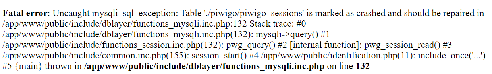

#  Tyzen9 - docker-piwigo
This all-in-one Docker stack provides [Piwigo](https://piwigo.org/) and the required mysql database, providing an open-source photo gallery platform designed for managing and sharing digital images. It provides a user-friendly web interface with features such as albums, tagging, metadata management, batch processing, and access control. Piwigo is especially useful for organizing personal collections, collaborative galleries, or professional photography archives. 

<p align="center">
&nbsp;&nbsp;&nbsp;&nbsp;&nbsp;&nbsp;&nbsp;&nbsp;

</p> 


## Prerequisites
In production it's generally best to use [Docker Engine](https://docs.docker.com/get-docker/) on a Linux host operating system, and a lightweight service delivery platform designed for managing containerized applications such as [Portainer](https://www.portainer.io/). This documentation assumes you have a working knowledge of [Docker](https://www.docker.com/).

## Configuration
This `docker-compose` implementation is configured using the `environment` section of the `compose.yaml` file.  

# What's Inside?
This Docker stack contains everything you need to host a [Piwigo](https://piwigo.org/) photo gallery. Here is what this project has to offer:

1. [Piwigo](https://docs.linuxserver.io/images/docker-piwigo/)
1. [MySQL](https://hub.docker.com/_/mysql/)

## Getting Started
Deploy the stack into your Docker environment. This can be done by cloning this repository, by downloading the most recent release, or just by simply copying the content of the `compose.yml` file and `sample.env` above. 

1. Make a copy of `sample.env`, and name it `.env`
1. Set the configuration options as desired in the `compose.yaml` and `.env` files.
1. Navigate to the project's root directory and run the following command:

```
docker compose up
```

> [!TIP]
> If you desire the ability to connect to the MySQL instance from another machine (for example with MySQL Workbench), then uncomment the following lines in the `docker-compose.yml` file by removing the `#` characters:

```yaml
    # ports:
    #  - ${MYSQL_EXTERNAL_PORT}:3306
```

If everything works as expected, you should be able to access Piwigo at http://hostname:8089.

> [!NOTE]
>This documentation assumes you have a working knowledge of [Docker](https://www.docker.com/), [MySQL](https://www.mysql.com/), and [Piwigo](https://piwigo.org/).


# Piwigo
When running the service for the first time, access Piwigo at `http://hostname:8089`, you will be prompted to install Piwigo. You will need information from the `.env` file to complete this.

<p align="center" width="100%">
    
</p>

### Database Configuration

1. For the `Host` use `mysql`, which is the service name in the `compose.yml` file
2. For `User` use the `MYSQL_USER` from the `.env` file
3. For `Password` use the `MYSQL_PASSWORD` from the `.env` file
4. For `Database name` use the `MYSQL_DATABASE` from the `.env` file

### Administration Configuration

These are the settings that are used to configure the Piwigo administration console.  You should use a strong username and password combination here.

Finally, click `Start Installation` and you Piwigo is set and ready to be used.  The first thing you will likely want to do is login to the Administration Panel and [import your galleries](https://piwigo.org/doc/doku.php?id=user_documentation:learn:add_picture). 

# Troubleshooting
Any common issues I come across will be documented here

## 1. Table marked as "crashed"
Occasionally we have seen tables marked as "crashed" in MySQL. This often happens when the database runs out of disk space, of if the server was not cleanly shutdown. 

Here is ane example of this error message that appears in the browser
<p align="center" width="100%">
    
</p>

To repair this, we must connect the shell of the MySQL container. We can do this with the following command:

```sh
docker exec -it piwigo-mysql sh
```
In that continer, run the following command 
```
mysql piwigo -u root -p
```
- Enter the mysql root password, found in the docker container environment settings
- At the resulting mysql prompt, run this command where <table_name> is the name of the corrupt table.  In this case using the screen shot above we see that the name of the table is `piwigo_sessions`.
```
REPAIR TABLE `<table_name>`;
```
Reload Piwigo and the problem should be resolved