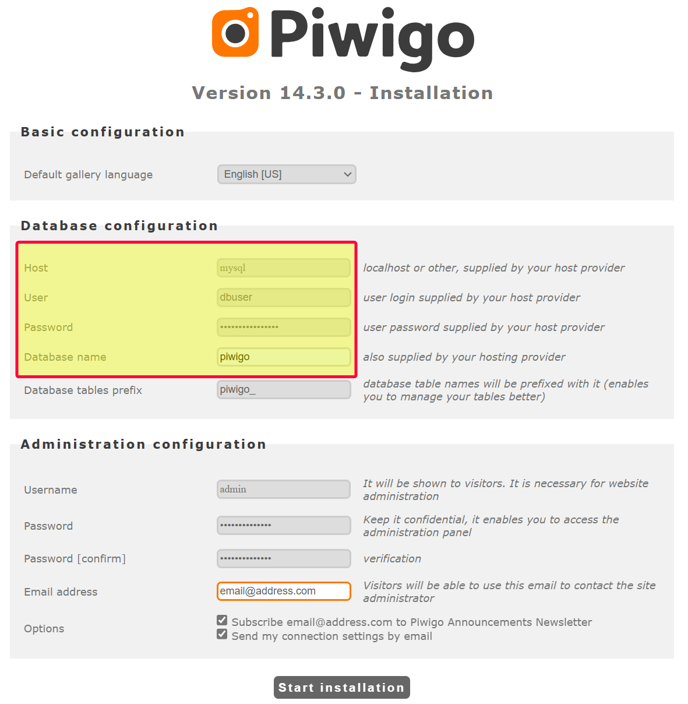
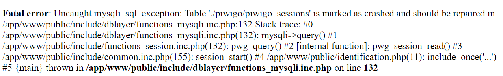

<p align="center">
  
</p> 

#  Tyzen9 - Piwigo and MySQL Docker Stack
Docker Stack that provides a [Piwigo](https://piwigo.org/) photo library backed by a MySQL container.

> [!NOTE]
>This documentation assumes you have a working knowledge of [Docker](https://www.docker.com/), [MySQL](https://www.mysql.com/), and [Piwigo](https://piwigo.org/).

## Perquisites
- [Docker Engine](https://docs.docker.com/engine/install/)

## Getting Started
1. Copy the `doceker-compose.yml` and `sample.env` files into an empty directory.
2. Rename the `.env.sample` file to `.env`
3. Edit the `.env` file and populate the parameters according to your environment.

> [!TIP]
> The `.env` file is where you can declare what versions of Piwigo and MySQL you desire.

If you desire the ability to connect to the MySQL instance from another machine (for example with MySQL Workbench), then uncomment the following lines in the `docker-compose.yml` file by removing the `#` characters:

```yaml
    # ports:
    #  - ${MYSQL_EXTERNAL_PORT}:3306
```

## Start the Container (Development/Testing)
In the new directory containing the `doceker-compose.yml` and `sample.env` files run the following command to start the docker stack.
```
docker compose up
```

## First time Piwigo "Installation"
When running the service for the first time, access Piwigo at `http://\<host_name\>:\<PIWIGO_EXTERNAL_PORT\>`, you will be prompted to install Piwigo. You will need information from the `.env` file to complete this.

<p align="center" width="100%">
    
</p>

### Database Configuration

1. For the `Host` use `mysql`, which is the service name in the `docker-compose.yml` file
2. For `User` use the `MYSQL_USER` from the `.env` file
3. For `Password` use the `MYSQL_PASSWORD` from the `.env` file
4. For `Database name` use the `MYSQL_DATABASE` from the `.env` file

### Administration Configuration

These are the settings that are used to configure the Piwigo administration console.  You should use a strong username and password combination here.

Finally, click `Start Installation` and you Piwigo is set and ready to be used.  The first thing you will likely want to do is login to the Administration Panel and [import your galleries](https://piwigo.org/doc/doku.php?id=user_documentation:learn:add_picture). 

## Troubleshooting
Any common issues I come across will be documented here

### 1. Table marked as "crashed"
Occasionally we have seen tables marked as "crashed" in MySQL. This often happens when the database runs out of disk space, of if the server was not cleanly shutdown. 

Here is ane example of this error message that appears in the browser
<p align="center" width="100%">
    
</p>

To repair this, we must connect the shell of the MySQL container. We can do this with the following command:

```sh
ocker exec -it piwigo-mysql sh
```
In that continer, run the following command 
```
mysql piwigo -u root -p
```
- Enter the mysql root password, found in the docker container environment settings
- At the resulting mysql prompt, run this command where <table_name> is the name of the corrupt table.  In this case using the screen shot above we see that the name of the table is `piwigo_sessions`.
```
REPAIR TABLE `<table_name>`;
```
Reload Piwigo and the problem should be resolved